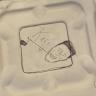

<section class="gl-hero">

Open civic data · Government Transparency

<h1 class="gl-h1">See what your government is doing. Then use the data yourself.</h1>

A nationwide layer of open legislative data. Every U.S. legislature, ready to explore, query, clone, and build on.

<a class="gl-btn gl-btn-primary" href="#projects">See the projects</a><a class="gl-btn gl-btn-ghost" href="#build">Get the data</a>

<canvas class="gl-embers"></canvas>

</section>

<section class="gl-proof" aria-label="By the numbers">

56jurisdictions — all 50 states, federal, DC &amp; 4 territories

&lt; 1 minto clone every dataset

$0to tag bills — private models run on free CI

2× a dayrefreshed from official sources

</section>

<section class="gl-crew" aria-label="Built by the Govbot community">

<b style="background:#F87171"></b><b style="background:#FBBF24"></b><b style="background:#3FB37F"></b>govbot — terminal

<i>$</i> govbot init<i>$</i> govbot clone wy il<i>$</i> govbot logs | govbot tag<i>$</i> govbot load --memory-limit 32GB<i>$</i> govbot build<i>$</i> duckdb --ui govbot_data/govbot.duckdb<b class="gl-crew-caret"></b>

<svg width="14" height="14" viewBox="0 0 24 24" fill="none" stroke="currentColor" stroke-width="2" stroke-linecap="round" aria-hidden="true"><circle cx="6" cy="6" r="2.5"/><circle cx="6" cy="18" r="2.5"/><circle cx="18" cy="18" r="2.5"/><path d="M6 8.5v7M18 15.5V10a3 3 0 0 0-3-3h-4"/></svg>Pull request #192Merged

Shared site header, logo → homepage, live Social bots feed

<svg width="13" height="13" viewBox="0 0 24 24" fill="none" stroke="currentColor" stroke-width="2" stroke-linecap="round" stroke-linejoin="round" aria-hidden="true"><path d="M6 3h9l4 4v14H6z"/><path d="M14 3v5h5"/></svg>govbot.yml

1<em>repos</em>:2  - all3<em>tags</em>:4  <em>housing</em>:5    <em>description</em>: |6      Housing affordability, rental and7      tenant protections, evictions,8    <em>threshold</em>: <u>0.72</u>

<svg width="18" height="18" viewBox="0 0 24 24" fill="none" stroke="currentColor" stroke-width="2" stroke-linecap="round" aria-hidden="true"><path d="M4 11a9 9 0 0 1 9 9"/><path d="M4 4a16 16 0 0 1 16 16"/><circle cx="5" cy="19" r="1"/></svg>hearings.xmlRefreshed twice a day

Government moves every day — Govbot helps everyone keep up. Built by people who believe civic information should be open to everyone.

<a class="gl-crew-btn" href="https://github.com/chihacknight/govbot/graphs/contributors?all=1" target="_blank" rel="noopener">18 contributors · Meet them ↗</a>

</section>

<section id="projects" class="gl-sec">

<h2 class="gl-h2">Projects built on Govbot</h2>
Each one runs on the same open data. Yours could be next.

1 / 5<button type="button" class="gl-navbtn" data-car="prev" aria-label="Previous project" disabled><svg width="20" height="20" viewBox="0 0 24 24" fill="none" stroke="currentColor" stroke-width="2" stroke-linecap="round" stroke-linejoin="round" aria-hidden="true"><path d="M15 6l-6 6 6 6"/></svg></button><button type="button" class="gl-navbtn" data-car="next" aria-label="Next project"><svg width="20" height="20" viewBox="0 0 24 24" fill="none" stroke="currentColor" stroke-width="2" stroke-linecap="round" stroke-linejoin="round" aria-hidden="true"><path d="M9 6l6 6-6 6"/></svg></button>

<button type="button" class="gl-chip" data-slide="0" aria-pressed="true">Legislation</button><button type="button" class="gl-chip" data-slide="1" aria-pressed="false">Hearings</button><button type="button" class="gl-chip" data-slide="2" aria-pressed="false">Elections</button><button type="button" class="gl-chip" data-slide="3" aria-pressed="false">Social bots</button><button type="button" class="gl-chip" data-slide="4" aria-pressed="false">Your project</button>

<article class="gl-slide" style="--pc: var(--gb-blue-hi)" aria-roledescription="slide" aria-label="1 of 5: Legislation">

<svg width="22" height="22" viewBox="0 0 24 24" fill="none" stroke="currentColor" stroke-width="1.8" stroke-linecap="round" stroke-linejoin="round" aria-hidden="true"><path d="M6 3h9l4 4v14H6z"/><path d="M9 9h6M9 13h6M9 17h4"/></svg>Legislation

<h3 class="gl-h3">What is government doing?</h3>

Bills from 56 jurisdictions — by place, topic, sponsor and status.

<a class="gl-btn gl-btn-primary gl-slide-cta" href="dashboard/legislation.html">Explore legislation</a>

Recent activitynewest bill per state

Loading recent bills…

</article>
<article class="gl-slide" style="--pc: var(--gb-primary-hi)" aria-roledescription="slide" aria-label="2 of 5: Hearings and public comment">

<svg width="22" height="22" viewBox="0 0 24 24" fill="none" stroke="currentColor" stroke-width="1.8" stroke-linecap="round" stroke-linejoin="round" aria-hidden="true"><path d="M3 21h18"/><path d="M5 21V10l7-5 7 5v11"/><path d="M9 21v-6h6v6"/></svg>Hearings &amp; public comment

<h3 class="gl-h3">Can I have a say?</h3>

Upcoming hearings, and the comment or witness-slip form for each one.

<a class="gl-btn gl-btn-primary gl-slide-cta" href="dashboard/hearings.html">See hearings</a>

Coming up

Loading upcoming hearings…

</article>
<article class="gl-slide" style="--pc: var(--gb-amber-hi)" aria-roledescription="slide" aria-label="3 of 5: Illinois elections">

<svg width="22" height="22" viewBox="0 0 24 24" fill="none" stroke="currentColor" stroke-width="1.8" stroke-linecap="round" stroke-linejoin="round" aria-hidden="true"><path d="M4 8l8-4 8 4-8 4z"/><path d="M4 8v8l8 4 8-4V8"/><path d="M12 12v8"/></svg>Illinois elections

<h3 class="gl-h3">What's on my ballot?</h3>

Every race and candidate, down to your Chicago ward.

<a class="gl-btn gl-btn-primary gl-slide-cta" href="dashboard/elections.html">Find your ballot</a>

Next Illinois election
November 3, 2026

Governor &amp; statewide offices, U.S. Senate &amp; House, the General Assembly and the CPS board.

Then: Chicago municipal · February 23, 2027

</article>
<article class="gl-slide gl-slide-bots" style="--pc: var(--gl-teal)" aria-roledescription="slide" aria-label="4 of 5: Social bots">

<svg width="22" height="22" viewBox="0 0 24 24" fill="none" stroke="currentColor" stroke-width="1.8" stroke-linecap="round" stroke-linejoin="round" aria-hidden="true"><path d="M4 11a9 9 0 0 1 9 9"/><path d="M4 4a16 16 0 0 1 16 16"/><circle cx="5" cy="19" r="1"/></svg>Legislation tracker · 13 topics · 4 platforms

<h3 class="gl-h3">Track legislation wherever you scroll.</h3>

Govbot's social media bots track bills from Congress and state legislatures, summarize them in plain English, and put them where you already follow the news — across Bluesky, Twitter, Threads and Instagram.

Topics tracked
AI, Data Centers &amp; CryptoCriminal JusticeEducationElections &amp; VotingEnvironment &amp; ClimateHealthcareHousingImmigrationLaborLGBTQReproductive RightsTaxationTransportation

Follow along
<a class="gl-plat" href="https://bsky.app/profile/govboteducation.bsky.social" target="_blank" rel="noopener" aria-label="Govbot on Bluesky"><svg viewBox="0 0 24 24" fill="currentColor" aria-hidden="true"><path d="M12 10.8c-1.087-2.114-4.046-6.053-6.798-7.995C2.566.944 1.561 1.266.902 1.565.139 1.908 0 3.08 0 3.768c0 .69.378 5.65.624 6.479.815 2.736 3.713 3.66 6.383 3.364.136-.02.275-.039.415-.056-.138.022-.276.04-.415.056-3.912.58-7.387 2.005-2.83 7.078 5.013 5.19 6.87-1.113 7.823-4.308.953 3.195 2.81 9.498 7.823 4.308 4.556-5.073 1.082-6.498-2.83-7.078a8.741 8.741 0 0 1-.415-.056c.14.017.279.036.415.056 2.67.297 5.568-.628 6.383-3.364.246-.828.624-5.789.624-6.478 0-.69-.139-1.861-.902-2.206-.659-.298-1.664-.62-4.3 1.24C16.046 4.748 13.087 8.687 12 10.8Z"/></svg>Bluesky ↗</a><a class="gl-plat" href="https://x.com/Govbot27" target="_blank" rel="noopener" aria-label="Govbot on Twitter (X)"><svg viewBox="0 0 24 24" fill="currentColor" aria-hidden="true"><path d="M18.901 1.153h3.68l-8.04 9.19L24 22.846h-7.406l-5.8-7.584-6.638 7.584H.474l8.6-9.83L0 1.154h7.594l5.243 6.932ZM17.61 20.644h2.039L6.486 3.24H4.298Z"/></svg>Twitter ↗</a><a class="gl-plat" href="https://www.threads.com/@legislationtracker.govbot" target="_blank" rel="noopener" aria-label="Govbot on Threads"><svg viewBox="0 0 24 24" fill="none" stroke="currentColor" stroke-width="2" stroke-linecap="round" aria-hidden="true"><path d="M16.5 11.2c-.3-3-2.1-4.4-4.6-4.4-2.2 0-3.6 1-4.2 2.3"/><path d="M8.2 14.6c.2 1.5 1.6 2.4 3.4 2.3 2.4-.1 4-1.7 4-4.6 0-.4 0-.8-.1-1.1-1-.2-2-.3-3-.2-2.2.1-3.5 1-3.4 2.4"/><path d="M19.4 7.2C18 4.2 15.4 2.6 12 2.6 6.6 2.6 3.6 6.3 3.6 12s3 9.4 8.4 9.4c3.4 0 5.8-1.3 7.1-3.7.9-1.7.9-3.6-.3-5.1"/></svg>Threads ↗</a><a class="gl-plat" href="https://www.instagram.com/legislationtracker.govbot/" target="_blank" rel="noopener" aria-label="Govbot on Instagram"><svg viewBox="0 0 24 24" fill="none" stroke="currentColor" stroke-width="1.9" aria-hidden="true"><rect x="3" y="3" width="18" height="18" rx="5.2"/><circle cx="12" cy="12" r="4"/><circle cx="17.4" cy="6.6" r="1.1" fill="currentColor" stroke="none"/></svg>Instagram ↗</a>

Latest from the bots · every platform

Loading the latest posts…

</article>
<article class="gl-slide gl-slide-yours" style="--pc: var(--gb-primary-hi)" aria-roledescription="slide" aria-label="5 of 5: Your project">

<svg width="22" height="22" viewBox="0 0 24 24" fill="none" stroke="currentColor" stroke-width="2" stroke-linecap="round" aria-hidden="true"><path d="M12 5v14M5 12h14"/></svg>Your project

<h3 class="gl-h3">Build the next one.</h3>

A newsletter, a bot, a class project, a newsroom tool — the data is yours.

<a class="gl-btn gl-btn-primary gl-slide-cta" href="#build">Start building</a>

Built something? Tell us on the Chi Hack Night Slack and we'll add it here.

<a href="https://chihacknight.slack.com/archives/C047500M5RS" target="_blank" rel="noopener">Share your project ↗</a>

</article>

</section>

<section id="build" class="gl-sec gl-band">

It's open. It's yours.<h2 class="gl-h2">Build your own</h2>
Each jurisdiction is a git repo. Tag bills with private, local models and query everything with SQL.

<ol class="gl-steps">
<li class="gl-step">1
Install
sh -c "$(curl -fsSL https://raw.githubusercontent.com/chihacknight/govbot/main/actions/govbot/scripts/install-nightly.sh)"<button type="button" class="gl-copy" aria-label="Copy install command">Copy</button>

</li>
<li class="gl-step">2
Run govbot
A short wizard picks your jurisdictions and topics, then sets up a GitHub Actions workflow.

</li>
<li class="gl-step">3
Run it again — or grab one state
Clones the data, tags bills, publishes RSS. Just want the data?

govbot clone il govbot load<button type="button" class="gl-copy" aria-label="Copy clone commands">Copy</button>

</li>
</ol>

No install? Ask an AI.

Paste this into Claude or ChatGPT — even on your phone:

Read this guide, then follow it to answer my question: https://raw.githubusercontent.com/chihacknight/govbot/main/llms.txt  Question: What's the status of Wyoming HB0001 in the 2025 session, who sponsored it, and what's the official source link?<button type="button" class="gl-copy" aria-label="Copy AI prompt">Copy</button>

<a class="gl-btn gl-btn-ghost" href="https://github.com/chihacknight/govbot/blob/main/catalog.json" target="_blank" rel="noopener">Data catalog ↗</a><a class="gl-btn gl-btn-ghost" href="https://github.com/chihacknight/govbot/blob/main/actions/format/docs/DATA_STRUCTURES.md" target="_blank" rel="noopener">Data structure ↗</a><a class="gl-btn gl-btn-ghost" href="about.html#querying-with-sql-duckdb">All commands &amp; SQL</a><a class="gl-btn gl-btn-ghost" href="https://github.com/chihacknight/govbot" target="_blank" rel="noopener">GitHub Repo ↗</a>

</section>

<section id="story" class="gl-sec">

<h2 class="gl-h2">Our story</h2>
<ol class="gl-timeline">
<li><a href="2022-Socratic-Center/index.html">2022 · Socratic Center</a>Find who represents you. Joined Chi Hack Night as a breakout group.</li>
<li><a href="2023-Civi-Social/index.html">2023 · Civi Social</a>Chicago residents talk directly with their elected officials.</li>
<li><a href="2024-Windy-Civi/index.html">2024 · Windy Civi</a>One app for local, state &amp; federal bills, with AI summaries.</li>
<li><a href="2025-Decentralize/index.html">2025 · Decentralize</a>No new app, no private APIs: open data anyone can run.</li>
<li class="is-now"><strong>2026 · Govbot today</strong>56 open datasets and the civic tools built on them.</li>
<li class="is-next"><strong>Next · On the roadmap</strong>From our open GitHub issues — anyone can pick one up.
<a class="gl-road-item" href="https://github.com/chihacknight/govbot/issues/25" target="_blank" rel="noopener"><b>Ask Govbot from ChatGPT or Claude ↗</b><i>An MCP server, so AI assistants can query the data directly.</i></a><a class="gl-road-item" href="https://github.com/chihacknight/govbot/issues/19" target="_blank" rel="noopener"><b>Easier installs ↗</b><i>Homebrew, npm, Docker and Windows.</i></a><a class="gl-road-item" href="https://github.com/chihacknight/govbot/issues/28" target="_blank" rel="noopener"><b>More of government ↗</b><i>Executive actions, Chicago City Council and full bill text.</i></a><a class="gl-road-item" href="https://github.com/chihacknight/govbot/issues/111" target="_blank" rel="noopener"><b>Fresher, fuller data ↗</b><i>Catch up lagging states and split repos by session.</i></a>
<a class="gl-road-cta" href="https://github.com/chihacknight/govbot/issues?q=is%3Aissue%20is%3Aopen%20label%3A%22good%20first%20issue%22" target="_blank" rel="noopener"><svg viewBox="0 0 24 24" fill="currentColor"><path d="M12 .3a12 12 0 0 0-3.8 23.4c.6.1.8-.3.8-.6v-2.2c-3.3.7-4-1.4-4-1.4-.6-1.4-1.4-1.8-1.4-1.8-1-.7.1-.7.1-.7 1.2.1 1.8 1.2 1.8 1.2 1 1.8 2.8 1.3 3.5 1 0-.8.4-1.3.7-1.6-2.7-.3-5.5-1.3-5.5-6 0-1.2.5-2.3 1.3-3.1-.2-.4-.6-1.6 0-3.2 0 0 1-.3 3.4 1.2a11.5 11.5 0 0 1 6 0C17.3 4.6 18.3 5 18.3 5c.7 1.6.2 2.9.1 3.2.8.8 1.3 1.9 1.3 3.1 0 4.6-2.8 5.6-5.5 5.9.4.4.8 1.1.8 2.2v3.3c0 .3.2.7.8.6A12 12 0 0 0 12 .3"/></svg>Pick a good first issue ↗</a></li>
</ol>

<h2 class="gl-h2">Questions</h2>

Can I see the code?

Yes. The toolkit and this site: <a href="https://github.com/chihacknight/govbot" target="_blank" rel="noopener">chihacknight/govbot ↗</a>. The data: one repo per jurisdiction at <a href="https://github.com/orgs/govbot-data/repositories" target="_blank" rel="noopener">govbot-data ↗</a>.

How is the data structured?

Each bill is a folder with its metadata, action logs and bill text. See the <a href="https://github.com/chihacknight/govbot/blob/main/actions/format/docs/DATA_STRUCTURES.md" target="_blank" rel="noopener">data structure ↗</a>.

How do I get the data?

Run govbot clone il (or all), or <a href="https://github.com/orgs/govbot-data/repositories" target="_blank" rel="noopener">browse the repos ↗</a>. To add a new jurisdiction, use the <a href="https://github.com/chihacknight/govbot/blob/main/actions/format/docs/for-caller-repos/README_TEMPLATE.md" target="_blank" rel="noopener">scraper template ↗</a>.

How do I stay in touch?

Join our channel on the <a href="https://chihacknight.slack.com/archives/C047500M5RS" target="_blank" rel="noopener">Chi Hack Night Slack ↗</a>, or follow us on Bluesky, X and Instagram (links below).

</section>

<section id="stream" class="gl-sec gl-finale">

<h2 class="gl-h2 gl-h2-lg">From the firehose to the point.</h2>
Govbot is an open-source infrastructure and data system that turns U.S. government legislative activity into structured, version-controlled, AI-processable data that anyone can build on.

<figure class="stream-figure">
<canvas id="stream-canvas" role="img" aria-label="Animation: a chaotic stream of raw government records — bills, hearings, votes, ballots, filings — flows in from the left into the Govbot robot, which sorts them into calm, labeled topic lanes on the right: AI and data centers, education, housing, labor rights, transportation, and more."></canvas>

Govbot

<figcaption class="stream-cap">Raw government activityUnderstandable topics</figcaption>
</figure>

<a class="gl-btn gl-btn-primary" href="#projects">Explore the projects</a><a class="gl-btn gl-btn-ghost" href="dashboard/architecture.html">How Govbot works</a><a class="gl-btn gl-btn-ghost" href="https://github.com/chihacknight/govbot" target="_blank" rel="noopener">Contribute on GitHub ↗</a>

</section>

